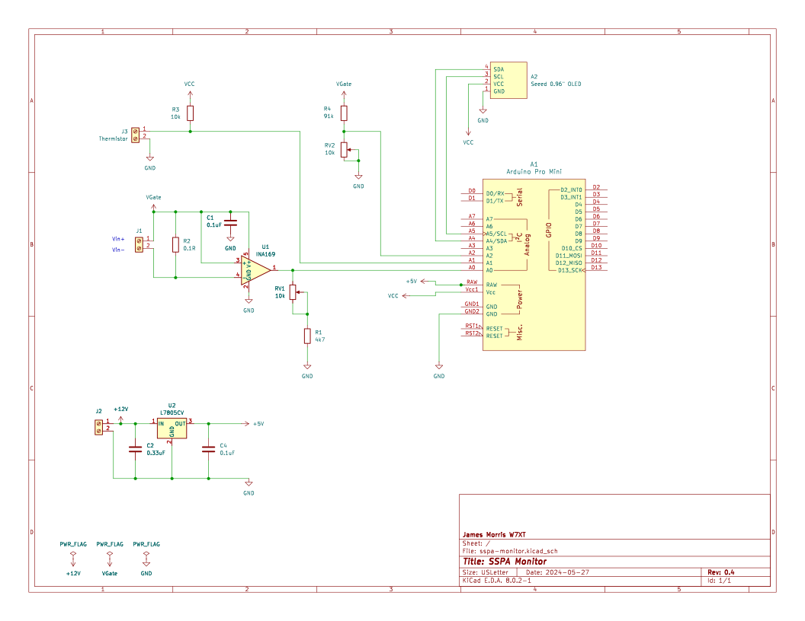

Very simple application for an Arduino Pro Mini to monitor characteristics of GAN RF SSPAs, up to 100W.

Initial monitoring covers Vg, Ig, and heatsink temperature. See the code for more information at this stage.

- James W7TXT

