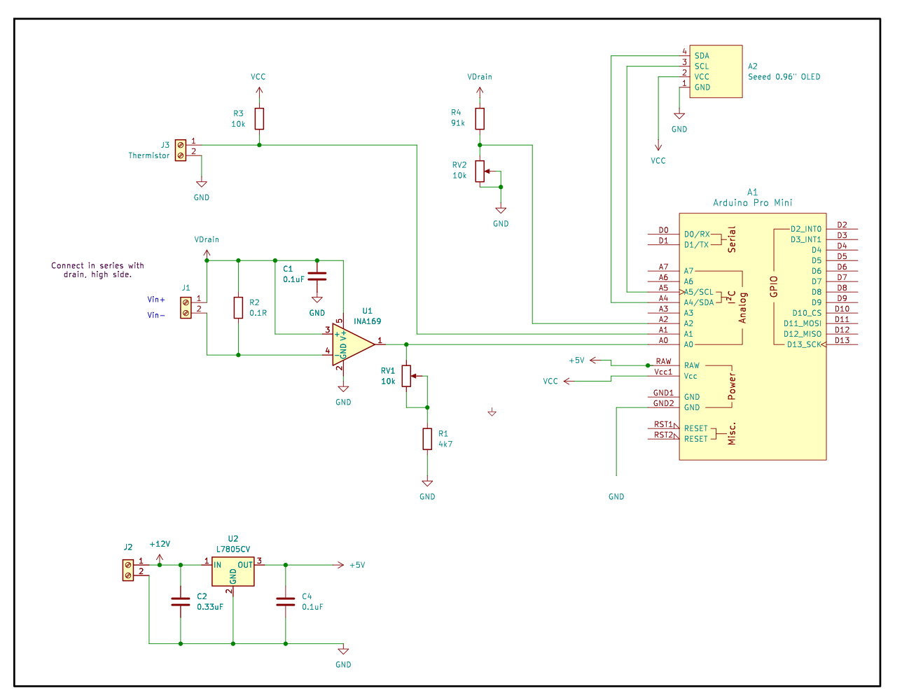

Very simple application for an Arduino Pro Mini to monitor characteristics of GAN RF SSPAs, up to 100W.

Initial monitoring covers Vd, Id, and heatsink temperature. I made this to do initial tetsing of a
30W GAN SSPA for 10 GHz, to set Idq and monitor temperature. This project may at some point be expanded
to monitor other parameters (Vg, power), drive fans, etc.

See the code for more information.

Copyright (c) 2024-2025, James Morris W7TXT.
